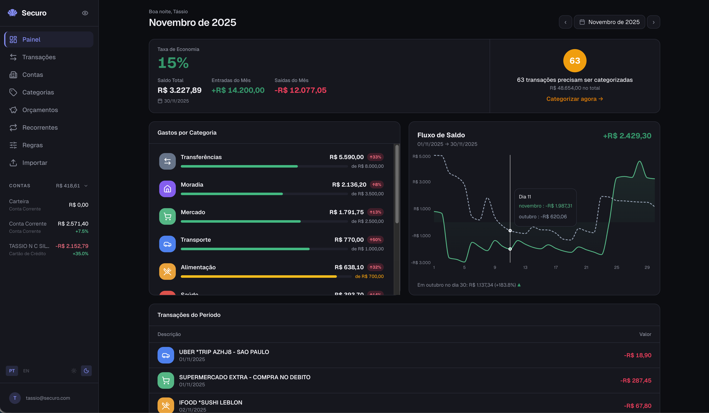

<p align="center">
  
</p>
<h1 align="center">Securo</h1>
<p align="center">
  <a href="https://github.com/securo-finance/securo/actions/workflows/ci.yml"></a>
  <a href="https://www.gnu.org/licenses/agpl-3.0"></a>
</p>

Open-source personal finance manager. Track accounts, categorize transactions, and understand your spending — with optional bank sync.

## Quick Start

```bash
docker compose up --build
```

Open [http://localhost:3000](http://localhost:3000) and create an account. That's it.

<p align="center">
  
</p>

## Features

- Multi-account management with running balances
- Transaction management with search, filters, and CSV export
- File import (OFX, QIF, CAMT, CSV)
- Auto-categorization rules engine
- Recurring transactions and budgets
- Dashboard with spending analytics and projections
- Bank sync via providers (Pluggy supported, extensible)
- Dark/light theme, multi-language support, privacy mode

## Bank Sync (Optional)

Create a `.env` file with your [Pluggy](https://pluggy.ai) credentials:

```
PLUGGY_CLIENT_ID=your-client-id
PLUGGY_CLIENT_SECRET=your-client-secret
```

Then restart: `docker compose up`

See the [full setup guide](https://securo.dev/getting-started/pluggy-setup/) for step-by-step instructions.

## Tech Stack

| Layer | Stack |
|-------|-------|
| Backend | FastAPI, SQLAlchemy, Alembic, Celery |
| Frontend | React, TypeScript, Vite, Tailwind CSS |
| Database | PostgreSQL |
| Queue | Redis + Celery |

## Development

```bash
# Run backend tests
docker compose exec backend pytest

# Rebuild after dependency changes
docker compose up --build
```

## Contributing

See [CONTRIBUTING.md](CONTRIBUTING.md) for guidelines.

## License

This project is licensed under the [GNU Affero General Public License v3.0](LICENSE).

This means you can freely use, modify, and distribute this software, but any modifications — including when used as a network service (SaaS) — must also be released under the AGPL-3.0.
